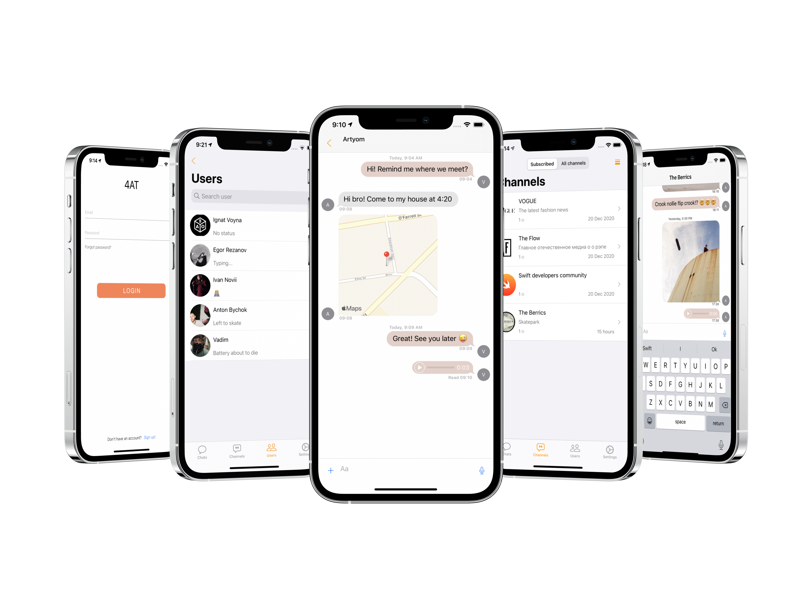

# Chat app "4AT"

## About 

Chat application with the ability to send text messages, user location, voice messages, photo and video messages. "4AT" ability to create a multi-user channel for publishing multimedia messages, PUSH-Notifications.

## Screenshots 

## used pods
   
#####  ⎔ MessageKit
#####  ⎔ RealmSwift
#####  ⎔ Gallery
#####  ⎔ RealmSwift
#####  ⎔ ProgressHUD
#####  ⎔ Firebase (Auth, Core, Storage, Messaging)
#####  ⎔ InputBarAccessoryView
#####  ⎔ SKPhotoBrowser
